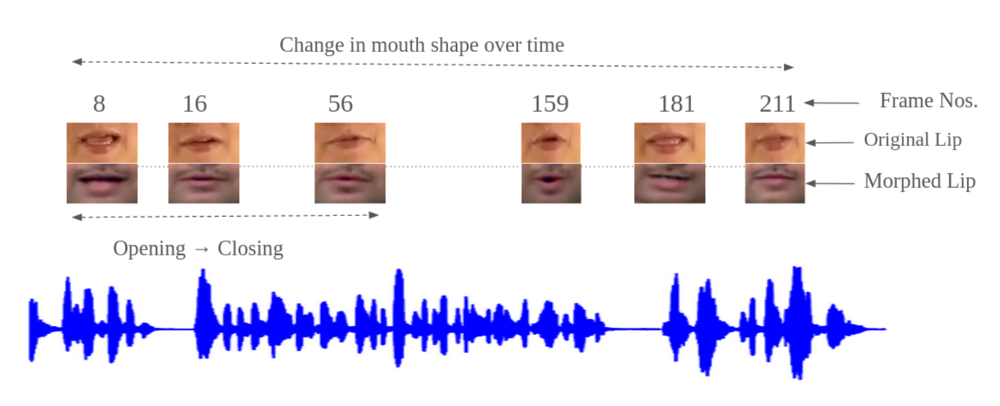

# LipSync


We aim to comprehend the effective utilization of video translation in an educational environment to convert its content into various Indian languages.


## Getting Started

### Requirements 
- Python>=3.8

```
pip install -r requirements.txt
```

### Training
The process involves two primary steps: (i) Training an expert lip-sync discriminator, and (ii) Training the Wav2Lip model(s).

- lip-sync discriminator
```
python color_syncnet_train.py --data_root lrs2_preprocessed/ --checkpoint_dir <folder_to_save_checkpoints>
```
- Wav2Lip
```
python train.py --data_root lrs2_preprocessed/ --checkpoint_dir <folder_to_save_checkpoints> --syncnet_checkpoint_path <path_to_expert_disc_checkpoint>
```

### Inference
You can synchronize any video (whether of a human face or animated character) with any audio, in any language.
```sh
python fa_batch_inference.py --checkpoint_path <checkpoint> --face <input_video.mp4> --audio <input_audio> --results_dir <output_directory>
```

| Models |  Description | Checkpoints |
| :-------------: | :---------------: | :---------------: |
| Wav2Lip model | place it in checkpints| [Link](https://drive.google.com/file/d/18ep_4lCSacF2M9I7d6I-izhAyTCkpn7j/view?usp=sharing)


### Run App
python app.py


# Results


## Citation

If you use this code in your research, please cite it as follows:
```
@inproceedings{Prajwal_2020, series={MM'20},
   title={A Lip Sync Expert Is All You Need for Speech to Lip Generation In the Wild},
   booktitle={Proceedings of the 28th ACM International Conference on Multimedia},
   author={Prajwal, K R and Mukhopadhyay, Rudrabha and Namboodiri, Vinay P. and Jawahar, C.V.},
   year={2020},
 }
```

